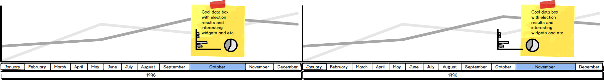

#NZ data visualisation thing

I think it would be interesting to make an open source web app for visualising NZ statistical data, particularly election and polling data.

Probably with [d3](http://d3js.org/)

Any ideas, contributions, corrections etc. welcomed. 

##Plan

A visualisation of a horizontally panning timeline divided into months, starting with the first MMP election in 1996: 

1. If it was the month the election was held in, the result of the general election in a data box with various stats.
2. If not, poll data for that month where available, otherwise interpolated between the last available poll or election result and the next available. 



I don't have a plan. I'm just going to pick away at it when I have time. 

##Currently contains

All I have so far is the 'minimum possible to be useful' election data in .json format for the first two MMP elections, 1996 and 1999.

##It would be really nice to get pull requests with:

- More years, if I'm working on one I'll check it in as an empty file before starting so you know not to bother.
- Candidate and electorate seat data for each year
 - Census data (so you can compare how many people 18+ and how many people enrolled etc.)
- Opinion poll results 

If you want to add some election result data, you can get it from Wikipedia:
- 1996 (done)
- 1999 (done)
- [2002](http://en.wikipedia.org/wiki/New_Zealand_general_election,_2002)
- [2005](http://en.wikipedia.org/wiki/New_Zealand_general_election,_2005)
- [2008](http://http://en.wikipedia.org/wiki/New_Zealand_general_election,_2008)
- [2011](http://en.wikipedia.org/wiki/New_Zealand_general_election,_2011)

##Example:

```javascript
{
  "1996": {    
    "date": "12/10/1996",
    "parliamentNumber": 45,
    "wikiSlug": "New_Zealand_general_election,_1996",
    "registered": 2418587,
    "results": {
      "National": {
        "party": 701315,
        "electorates": 30,
        "list": 14
      },
      "Labour": {
        "party": 584159,
        "electorates": 26,
        "list": 11
      },
      ...
    },
    "informal": 8183,
    "disallowedSpecial": 54633
  }
}
```